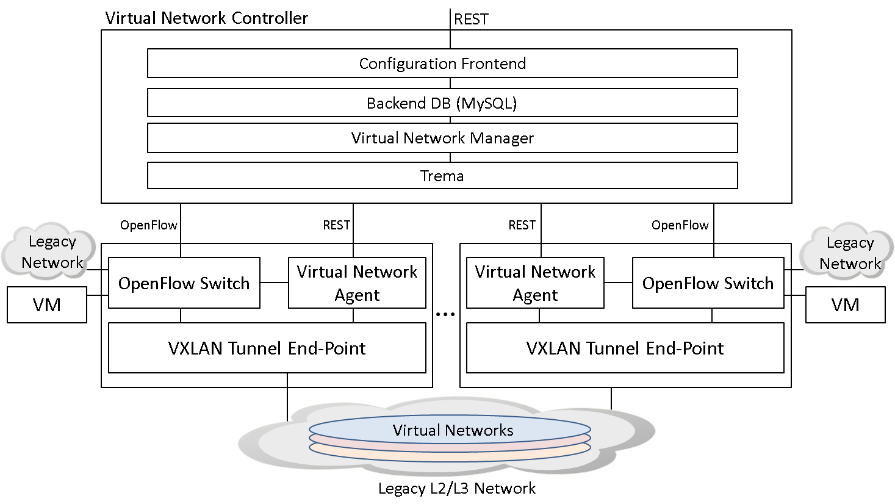
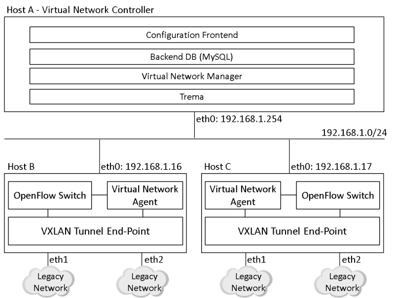

# What's this?

This is a software suite which allows you to construct and manage
VXLAN-based virtual networks with a single centralized management
point. The centralized management point provides a REST-based
interface for managing the virtual networks.

# How does it work?

VXLAN-based virtual networks are managed with the following system
architecture and software packages.

## System architecture

## Software packages

### Vritual Network Controller

Virtual Network Controller consists of the following tree
subcomponents.

1. Virtual Network Manager

Virtual Network Manager is an application responsible for managing
virtual networks. It retrieves configuration from the backend database
(see below for details) and make necessary changes in OpenFlow
switches and VXLAN tunnel endpoints. It acts as an OpenFlow
controller. It is developed on top of Trema which is an OpenFlow
framework for developing OpenFlow controllers and switches.

2. Backend Database

Backend Database stores virtual network configuration and operational
states of OpenFlow switches and Virtual Network Manager. It is a
database created on MySQL.

3. Configuration Frontend

Configuration Frontend provides a REST interface for managing virtual
networks. It works as a web server and allows you to create/delete
virtual networks, attach/detach switch ports to/from virtual networks,
associate/detach MAC addresses with/from switch ports via the REST
interface.

### Virtual Network Agent

Virtual Network Agent receives requests from Virtual Network Manager
to configure VXLAN tunnel endpoint and OpenFlow switch. It runs on the
same host as VXLAN tunnel endpoint and OpenFlow switch are running.

### VXLAN Tunnel End-Point

VXLAN Tunnel End-Point is a VXLAN tunnel endpoint implementation. It
can be a user space implementation included in this software suite or
standard Linux kernel implementation available on Linux 3.7.

### OpenFlow Switch

OpenFlow Switch is unmodified Open vSwitch (version 1.4.X). It is not
included in this software suite. For detailed information on Open
vSwitch, please visit http://openvswitch.org/.

# How to use?

## Prerequisite

At least, one host that runs Virtual Network Controller and two hosts
for Virtual Network Agent, VXLAN Tunnel End-Point, and OpenFlow switch
are required. The following operating system is only supported.

* Ubuntu 12.04.1 LTS Desktop (amd64)

Operating systems other than above are totally not tested and may not
work expectedly.

## Setup

We assume that the software suite is installed in the following
environment.

### Virtual Network Controller

1. Virtual Network Manager

Since Virtual Network Manager is developed on top of Trema, you need to
build Trema before building Virtual Network Manager.

1.1. Build Trema

  $ sudo apt-get install gcc make ruby rubygems ruby-dev libpcap-dev \
  libsqlite3-dev
  $ sudo gem install gli
  $ cd trema
  $ ./build.rb
  $ cd ..

1.2. Build Virtual Network Manager

  $ sudo apt-get install libcurl4-gnutls-dev libjson0-dev \
  libmysqlclient-dev
  $ cd virtual_network_manager/src
  $ make
  $ cd ../..

1.3. Setup init script

  $ sudo cp virtual_network_manager/init/virtual_network_manager \
  /etc/init.d
  $ sudo update-rc.d virtual_network_manager defaults
  $ sudo cp virtual_network_manager/init/trema /etc/init.d
  $ sudo update-rc.d trema defaults

1.4. Setup configuration files

  $ sudo cp virtual_network_manager/config/virtual_network_manager \
  /etc/default
  $ sudo cp virtual_network_manager/config/trema /etc/default

Edit the configuration files as follows:

  (TBD)

2. Backend Database

2.1. Install MySQL server and client

  $ sudo apt-get install mysql-server mysql-client

During the installation process, you may be asked to set a root's
password. We assume here that the password is set to "root123".

2.2. Edit /etc/my.cnf as follows:

  ...
  bind-address = 127.0.0.1
  ...

2.3. Add privileges to "root"

  $ mysql -u root --password=root123
  mysql> grant all privileges on *.* to root@localhost identified 
  by 'root123' with grant option;
  mysql> flush privileges;

2.4. Create database and tables

  $ cd backend_database
  $ ./create_database.sh
  $ cd ..

3. Configuration Frontend

3.1. Install Sinatra and ActiveRecord

  $ sudo apt-get install ruby-sinatra ruby-activerecord

3.2. Setup init script

  $ sudo cp configuration_frontend/init/configuration_frontend \
  /etc/init.d
  $ sudo update-rc.d configuration_frontend defaults

3.3. Setup configuration file

  $ sudo cp configuration_frontend/config/configuration_frontend \
  /etc/default

Edit the configuration file (/etc/default/configuration_frontend) as
follows:

  (TBD)

4. Start all required services

  $ sudo service mysql restart
  $ sudo service virtual_network_manager start
  $ sudo service configuration_frontend start

### Virtual Network Agent

1. Install Sinatra

  $ sudo apt-get install ruby-sinatra

2. Setup init script

  $ sudo cp virtual_network_agent/init/virtual_network_agent \
  /etc/init.d
  $ sudo update-rc.d virtual_network_agent defaults

3. Setup configuration file

  $ sudo cp virtual_network_agent/config/virtual_network_agent \
  /etc/default

Edit the configuration file (/etc/default/virtual_network_agent) as
follows:

  (TBD)

4. Start Virtual Network Agent

  $ sudo service virtual_network_agent start

### OpenFlow Switch (Open vSwitch)

1. Install Open vSwitch

  $ sudo apt-get install openvswitch-switch openvswitch-datapath-dkms

3. Create switch instance and add switch ports

  $ sudo ovs-vsctl add-br br0
  $ sudo ovs-vsctl add-port br0 eth1
  $ sudo ovs-vsctl add-port br0 eth2
 
3. Set datapath identifier and OpenFlow controller

Datapath id must be a 64-bit unique identifier for specifying the
switch instance. You need to assign a unique identifier for each
switch instance. Note hat datapath id may be specified with 16 digits
hexadecimal without "0x" prefix.

  $ sudo ovs-vsctl set Bridge br0 \
  other-config:datapath-id=[datapath id in hex]
  $ sudo ovs-vsctl set-controller br0 tcp:192.168.16.254
  $ sudo ovs-vsctl set-fail-mode br0 secure

4. Restart Open vSwitch

  $ sudo service openvswitch-switch restart

### VXLAN Tunnel End-Point

1. Build VXLAN Tunnel End-Point

  $ cd vxlan_tunnel_endpoint/src
  $ make
  $ cd ../..

2. Setup init script

  $ sudo cp vxlan_tunnel_endpoint/init/vxland /etc/init.d
  $ sudo update-rc.d vxland defaults

3. Setup configuration file

  $ sudo cp vxlan_tunnel_endpoint/config/vxland /etc/default

Edit the configuration file (/etc/default/vxland) as follows:

  (TBD)

4. Start VXLAN Tunnel End-Point

  $ sudo service vxland start

## How to manage virtual networks?

Here are simple examples that show how to manage virtual networks.
Please see files under doc/api for extended examples.

1. Create a virtual network

  $ curl -v \
  -H "Accept: application/json" \
  -H "Content-type: application/json" \
  -X POST \
  -d '{ "id": 128, "description": "Virtual network #128" }' \
  http://192.168.16.254/networks

2. Associate a switch port with a virtual network

  $ curl -v \
  -H "Accept: application/json" \
  -H "Content-type: application/json" \
  -X POST \
  -d '{ "id": 1, "datapath_id": "1", "name": "eth1",
  "vid": 65535, "description": "eth1 on switch #1" }' \
  http://192.168.16.254/networks/128

3. Associate a MAC address with a switch port

  $ curl -v \
  -H "Accept: application/json" \
  -H "Content-type: application/json" \
  -X POST \
  -d '{ "address" : "00:00:00:00:00:01" }' \
  http://192.168.16.254/networks/128/ports/1

# License & Terms

All software packages distributed here are licensed under the GNU
General Public License version 2.0:

http://www.gnu.org/licenses/gpl-2.0.html
